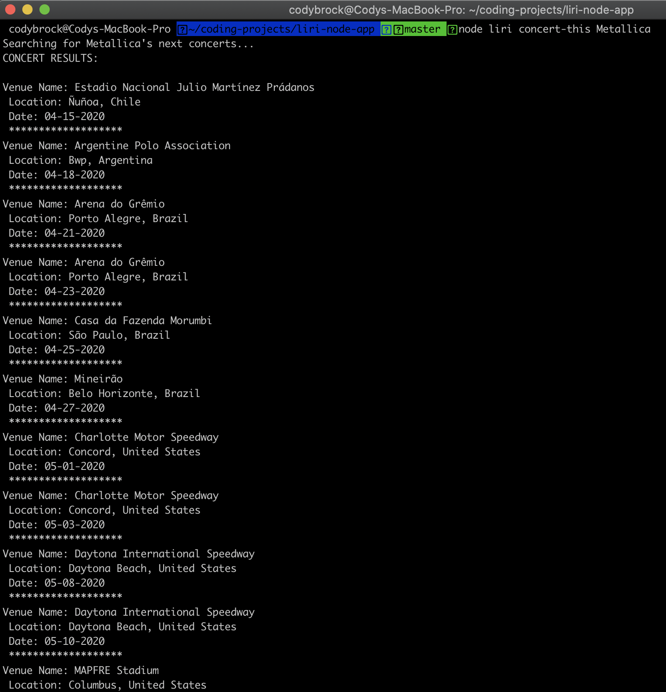
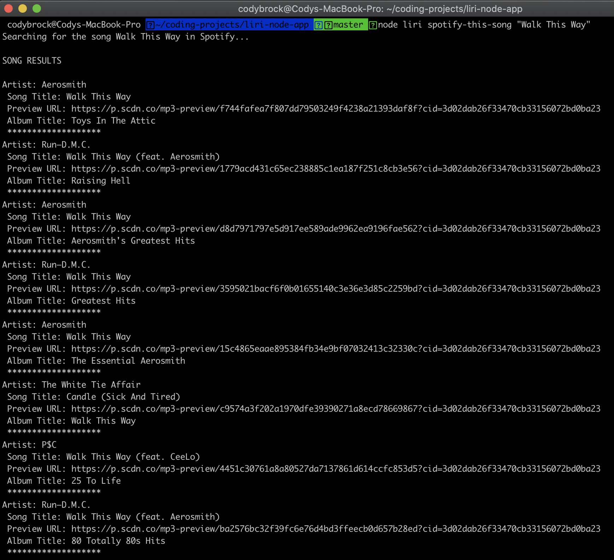
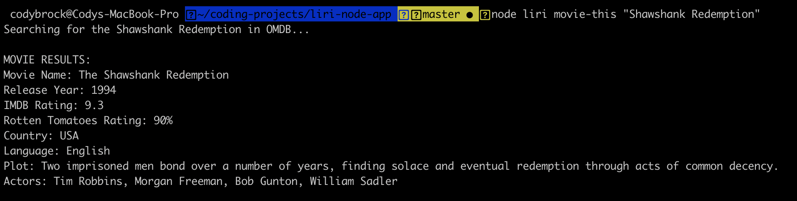
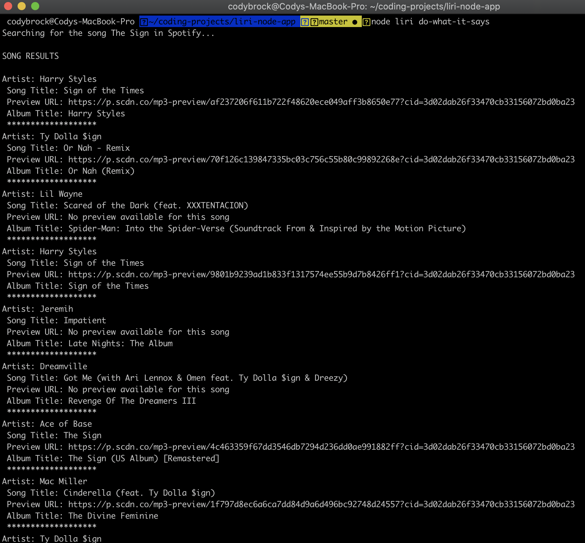
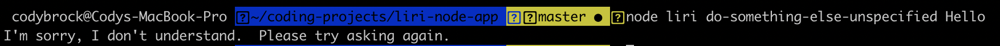

# liri-node-app

## Introduction
Hello there! Thank you for taking the time to see my project, "**LIRI**" (Language Interpretation and Resonse Interface). LIRI is a command line node app that takes in parameters and gives you back data.

## Overview
**liri.js** contains the logic of the program. 
* Section 1 of the file requires the various packages (dotenv, request, moment, node-spotify-app, axios, fs, and our local file keys.js).
* Section 2 parses the user's input, then passes that into the function *usercommand*, which uses a switch to either call the corresponding program or to tell the user their command was not understood.
* Section 3 includes the API calls and console.logs the results back to the users.
    * concertThis accepts the name of a music group... 
        * ...then uses *bandsintown* API to return information on the music group's upcoming concerts, including: 
            * venue name
            * location
            * date
    * spotifyThisSong accepts the name of a song...
        * ... and then uses the *spotify* API to return the song's:
            * artist
            * song title
            * spotify song preview url
            * album name
    * movieThis accepts the name of a movie...
        * ... and then uses the *omdb* API to return:
            * movie name
            * release year
            * IMDB rating
            * Rotten Tomatoes rating
            * country
            * language
            * plot
            * actors
    * doWhatItSays parses the information from random.txt and then calls *usercommand* with those parameters.

**keys.js** exports my spotify id and secret, from a .env file.

**.gitignore** keeps my node_modules, .env, and .DS_Store files from uploading to github.

**package.json** and **package-lock.json** lists the version numbers of the packages installed.

**random.txt** is a text file that liri.js can read using the function *doWhatItSays*

## How to Use It
Since Liri is a command line node app, all commands will be given from the terminal.  In your terminal, navigate to the filepath in your computer where liri.js and the corresponding files are saved.  

### Syntax
Once there, this is the syntax for how to call LIRI from your command line, with each entry separated by a space:

node | liri | **command* | +*parameter* |
------------ | ------------- | ------------- | ------------- |
Required | Required | Required | Optional |
User must type "node" first | User must type "liri" or "liri.js" second | See below for possible commands | See below for information on parameters |

### Commands and Parameters
*Command | +Parameter |
------- | --------- |
**concert-this** | Name of music artist you'd like to get upcoming concert inforamtion about |
**spotify-this-song** | Name of song you'd like to get spotify information for|
**movie-this** | Name of movie you'd like to get omdb information about | 
**do-what-it-says** | No parameters.  It will get its command and parameters from the random.txt file |

### Examples
* To find upcoming concert information for Metallica, you would enter "node liri concert-this Metallica"
* To get Spotify information about "Walk This Way," you would enter "node liri spotify-this-song 'Walk This Way'"
* To get OMDB information about "Shawshank Redemption," your would enter "node liri movie-this 'Shawshank Redemption'"
* To run the command and parameters in random.txt, you would enter "node liri do-what-it-says"

## Screenshots of the App Functioning
* concert-this:

* spotify-this-song:

* movie-this:

* do-what-it-says:

* If you enter a command that is not recognized, LIRI will tell you so:

## Link to Deployed Version of the App
[GitHub](https://cody-brock.github.io/liri-node-app/)
**???? Does this work ????**

## Technologies Used
* Packages:
    * DotEnv
    * request
    * moment
    * node-spotify-api
    * axios
    * fs
* APIs:
    * bandsintown
    * spotify
    * omdb

## My Role in App Development
I developed the app on my own, using the project's instructions as a template to start from.

**Thank you again!  If you have any questions, please contact me at codylewisbrock@gmail.com**